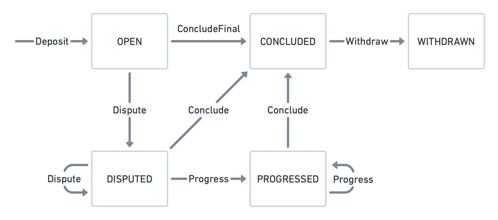

<h1 align="center"><br>
    <a href="https://perun.network/"></a>
<br></h1>

<h4 align="center">Perun Polkadot Pallet</h4>

<p align="center">
  <a href="https://www.apache.org/licenses/LICENSE-2.0.txt"></a>
  <a href="https://github.com/perun-network/perun-polkadot-pallet/actions/workflows/rust.yml"></a>
  <a href="https://codecov.io/gh/perun-network/perun-polkadot-pallet">
    
  </a>
</p>

*Perun Polkadot Pallet* provides [go-perun] state channels for all Substrate compatible blockchains.  
Using it in your blockchain means to include it just like any other Substrate Pallet.

## Repo Structure

* `src/`
  * [lib.rs] pallet logic
  * [types.rs] type definitions
* `tests/`
  * `common/`
    * [mock.rs] test configuration
    * [utils.rs] test helpers
  * [unit.rs] pallet unit tests
  * function unit tests
* [Cargo.toml] module info and dependencies

## Protocol

A channel is opened by depositing funds for it into the contract by calling `Deposit`.
The participants of the channel can then do as many off-chain channel updates as they want.
When all participants come to the conclusion that the channel should be closed, they set the final flag on the channel state, and call `ConcludeFinal`.
All of them can then withdraw the outcome by calling `Withdraw`. 

*Dispute.* If the participants do not arrive at a final channel state off-chain, they need to resolve a dispute on-chain.
This allows any participant to enforce the last valid state, i.e., the mutually-signed state with the highest version number.
A dispute is initiated by calling `Dispute` with the latest available state.
A registered state can be refuted within a specified challenge period by calling `Dispute` with a newer state.
After the challenge period, the dispute can be concluded by calling `Conclude` and the funds can be withdrawn.

*On-chain progression.* This is an optional phase for channels with an app. It takes place after the dispute registration and allows to update the channel state without full consenus by calling the function `Progress`.

### State diagram



### Tests

The tests require at least rust version `1.52.0` and can be run with:
```bash
cargo test
```

or in docker:

```bash
# Run this each time you change something.
docker build -t perun .
docker run --rm perun
```

### Benchmarking

The benchmarks use cryptographic primitives which are only available in a Substrate node.  
A node is provided by the [Polkadot Node] repo of which this repo is a sub-repo.  
Have a look [there] for instructions on how to run the benchmarks.  

### Documentation

The in-code documentation can be opened with:

```bash
cargo doc --no-deps --open --package pallet-perun
```

## Funding

The development of this project is supported by the [Web3 Foundation] through the [Open Grants Program].  
The development of the go-perun library is supported by the German Ministry of Education and Science (BMBF) through a Startup Secure grant.

## Security Disclaimer

This software is still under development.
The authors take no responsibility for any loss of digital assets or other damage caused by the use of it.

## Copyright

Copyright 2022 PolyCrypt GmbH.  
Use of the source code is governed by the Apache 2.0 license that can be found in the [LICENSE file](LICENSE).

<!--- Links -->

[go-perun]: https://github.com/hyperledger-labs/go-perun
[Perun Pallet]: https://github.com/perun-network/perun-polkadot-pallet
[Polkadot Node]: https://github.com/perun-network/perun-polkadot-node
[there]: https://github.com/perun-network/perun-polkadot-node/blob/master/README.md#benchmarking
[frontend template]: https://github.com/substrate-developer-hub/substrate-front-end-template

[Open Grant]: https://github.com/perun-network/Open-Grants-Program/blob/master/applications/perun_channels.md#w3f-open-grant-proposal
[Web3 Foundation]: https://web3.foundation/about/
[Open Grants Program]: https://github.com/w3f/Open-Grants-Program#open-grants-program-

[lib.rs]: src/lib.rs
[types.rs]: src/types.rs
[utils.rs]: tests/common/utils.rs
[mock.rs]: tests/common/mock.rs
[unit.rs]: tests/unit.rs
[Cargo.toml]: Cargo.toml
